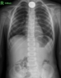
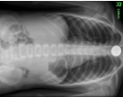
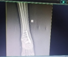
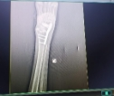
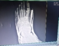
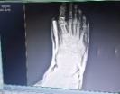
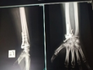
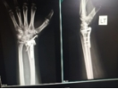

**Report**

**Dataset Description**

Class "Chest" has 300 pictures, while the rest of the classes contain 54, 105, 71, 271, 61, 34, and 23 images, respectively. Therefore, there is an imbalance in the dataset. We applied image augmentation techniques such as flipping and rotating (90°, 180°, 270°). With these augmentation techniques, each class now has 300 pictures.

**Classes:**

- Chest Fracture = 0
- foot Fracture= 1
- hand Fracture = 2
- hip Fracture = 3
- leg Fracture = 4
- shoulder Fracture = 5
- spinal cord Fracture = 6
- ulna and radius upper arm bone fracture = 7

All models other than VGG 16 used following layers:

1. Flatten
1. Dense with 128 units

**Hyperparameters:**

- RMSprop(learning\_rate=1e-5)
- Epochs 10

**Best Model:**

DenseNet201

|

**Model**
|

**Accuracy**
|

**Loss**
||||||||
| :-: | :-: | :-: | :- | :- | :- | :- | :- | :- | :- |
||

**train**
|

**Validation**
|

**Test**
|

**train**
|

**Validation**
|

**Test**
||||
|
VGG-16

|97\.02%|94\.34%|95\.2%|0\.23|0\.25|0\.19%||||
|
VGG – 19

|98%|96%|95%|0\.17|0\.21|0\.1772%||||
|ResNet50V2|98\.9%|97%|92%|0\.13|0\.20|0\.27||||
|DenseNet201|98\.7%|94%|96%|0\.12|0\.18|0\.17||||

**Augmentation:**

`      `**Simple                   Augmented                                  Simple                                  Augmented**

                        

               

**VGG-16**

**Fine Tuning**

We applied the VGG-16 model and fine-tuned the last block 5, achieving an accuracy of 99% on the training set. However, the validation accuracy was only 70%, indicating overfitting. There was a significant difference in loss, approximately 25% to 29%.

To mitigate overfitting, we added a dense layer with 128 neurons, applied a dropout of 0.2, and included batch normalization. This adjustment led to an improved performance with a training accuracy of 98% and validation accuracy of 95%. The loss values ranged between 0.25 to 0.30.

**layers:**

1. Flatten
1. Dense with 128 units
1. Dropout 0.2
1. Batch Normalization

**Test Accuracy Confusion Matrix and Classification report:**

**VGG – 19:**

**Removed dropout and batch normalization layer.**

**Test Accuracy Confusion Matrix and Classification report:**

**ResNet50V2:**

**Test Accuracy Confusion Matrix and Classification report:**

**DenseNet121:**

**Test Accuracy Confusion Matrix and Classification report:**

**Credit:**

**Hasnain Muavia**
## Authors

- [@HasnainMuavia](https://github.com/HasnainMuavia1)

